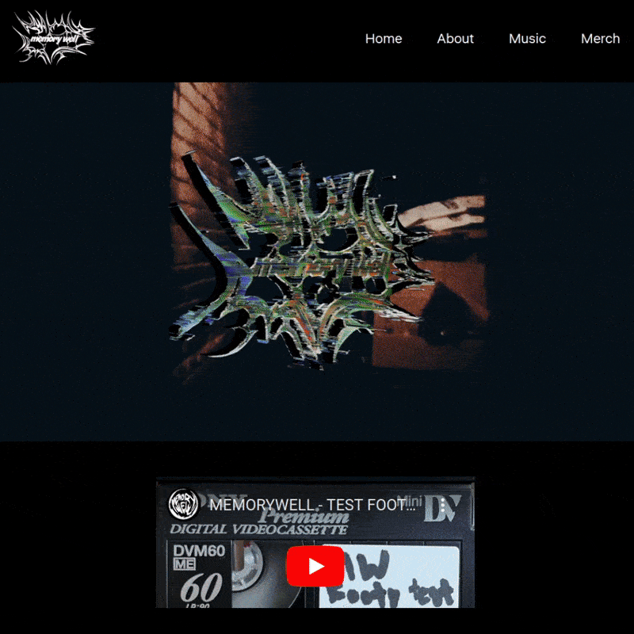

Official website of Memory Well

### Almost Real Release Todo
- [x] Global styling 
    - Map mode key to style values, i.e. {"mode": {"accentColor": ..., "heroImage": ...}}
    - Define these by hand
- [ ] Make Navbar use React router instead of re-rendering it when switching tabs
- [ ] Code cleanup
    - Chat gippity made a mess

### 🧊 Cool Features

- **Spotify API:** Automatically track and list the band's releases using info from the Spotify web API!

---

**Made by Rafa with ❤️**
